# Flippopotamus
## A Flipping Memory Game

A simple mobile app game, build with Flutter, using Flutter animation

## Complete Walkthrough
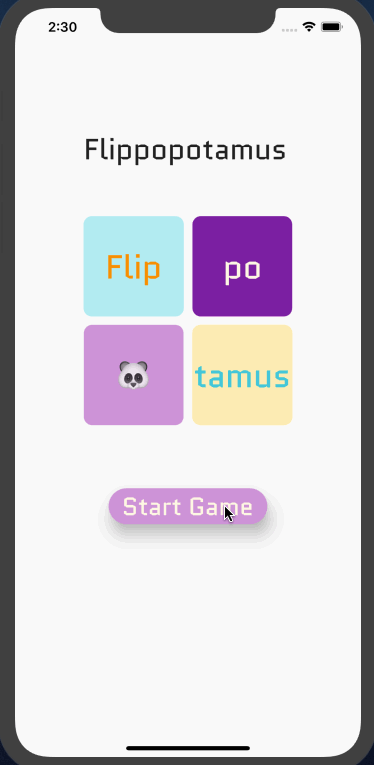</img> 

## Screens

Welcome Screen
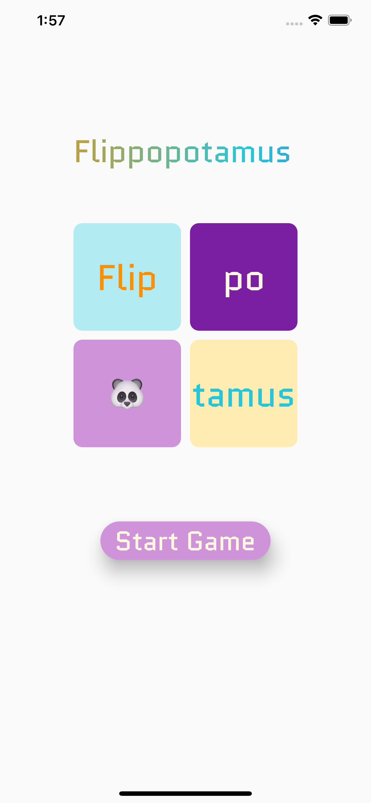</img> 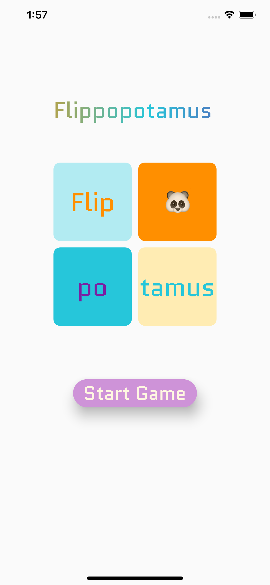</img>

Choose Theme and Lelvel
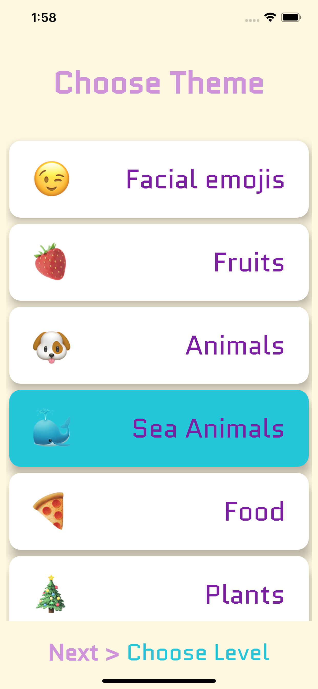</img> 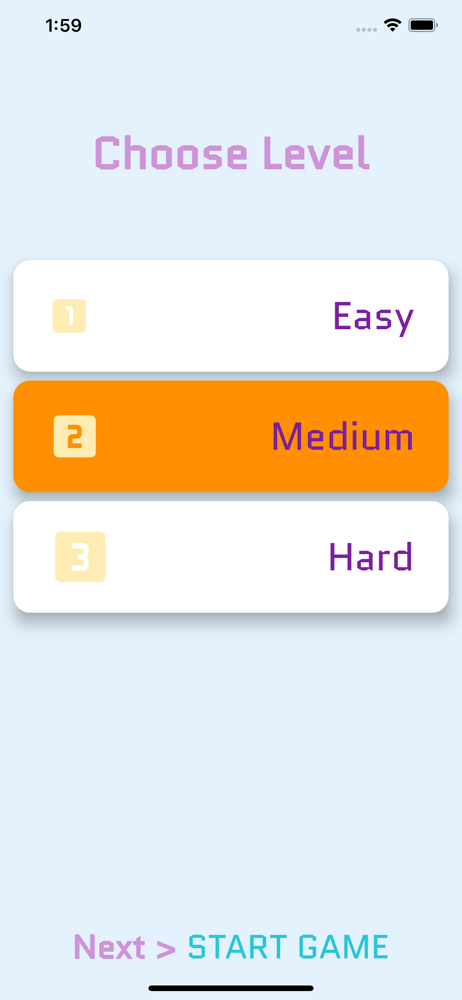</img>

Play Screen (Easy/Medium/Hard)
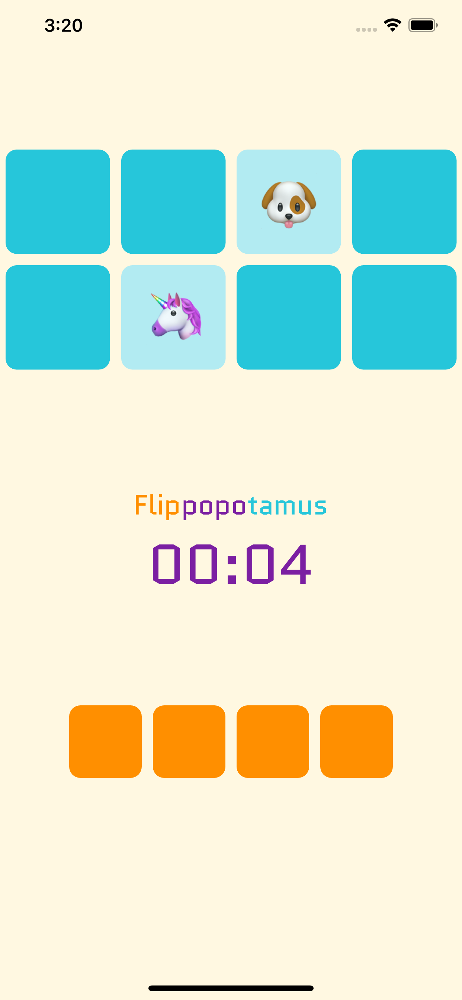</img> 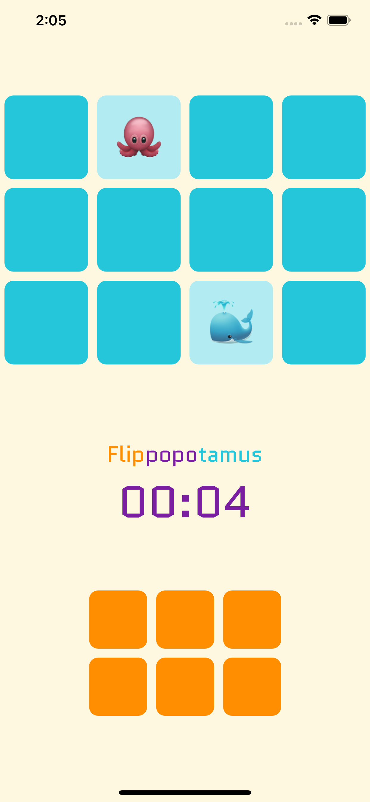</img> 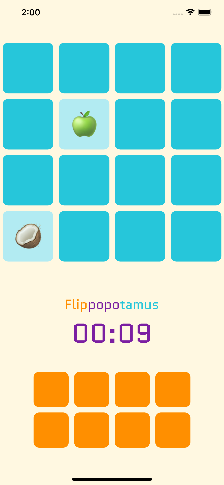</img>

Summary Screen (Easy/Medium/Hard)
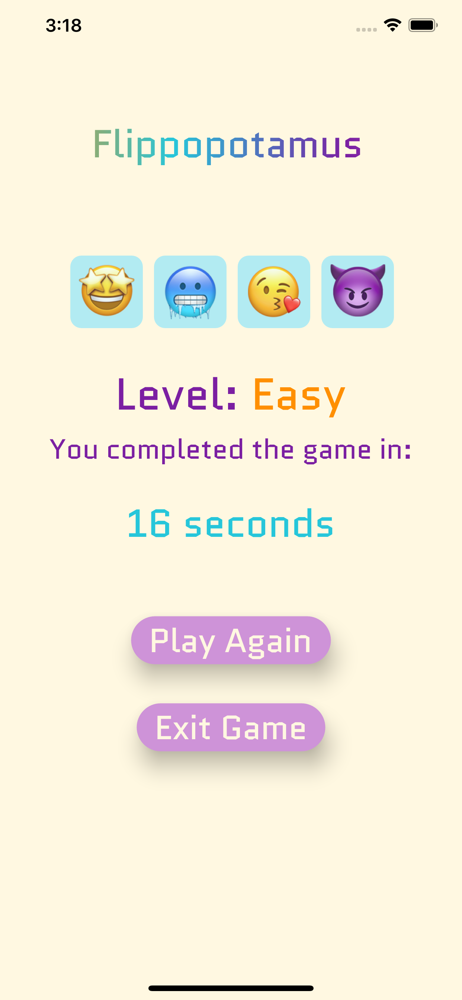</img> 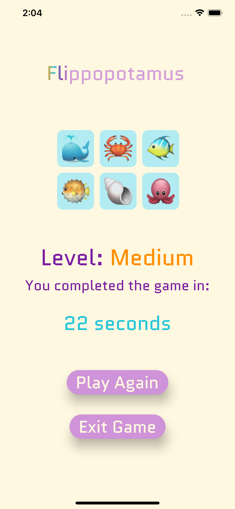</img> 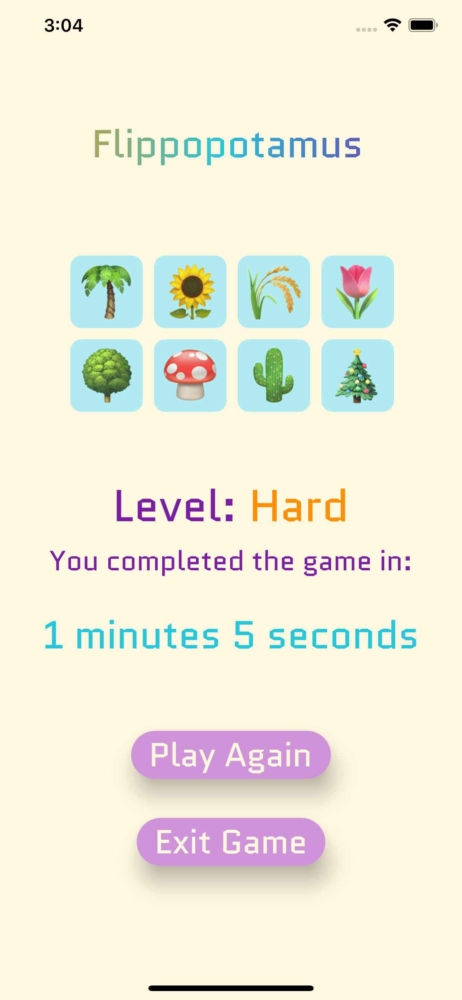</img>
